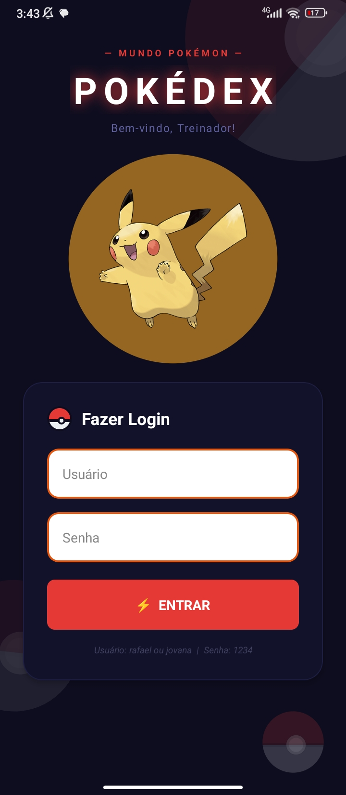
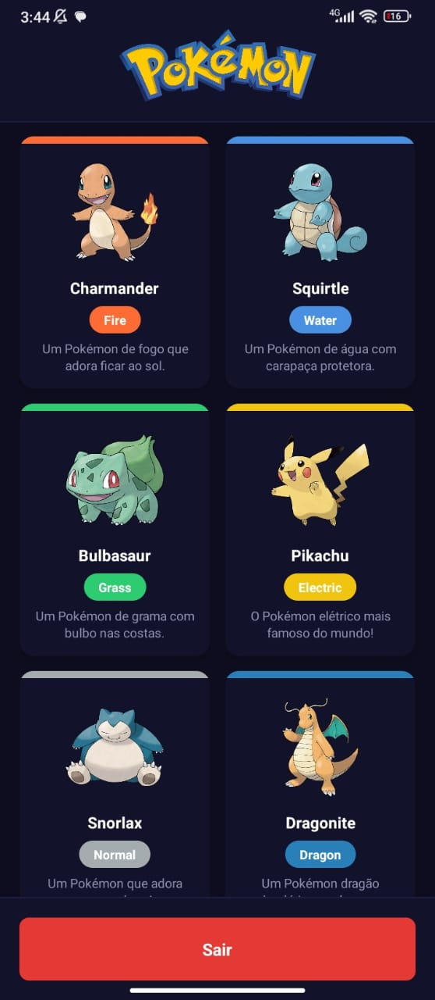
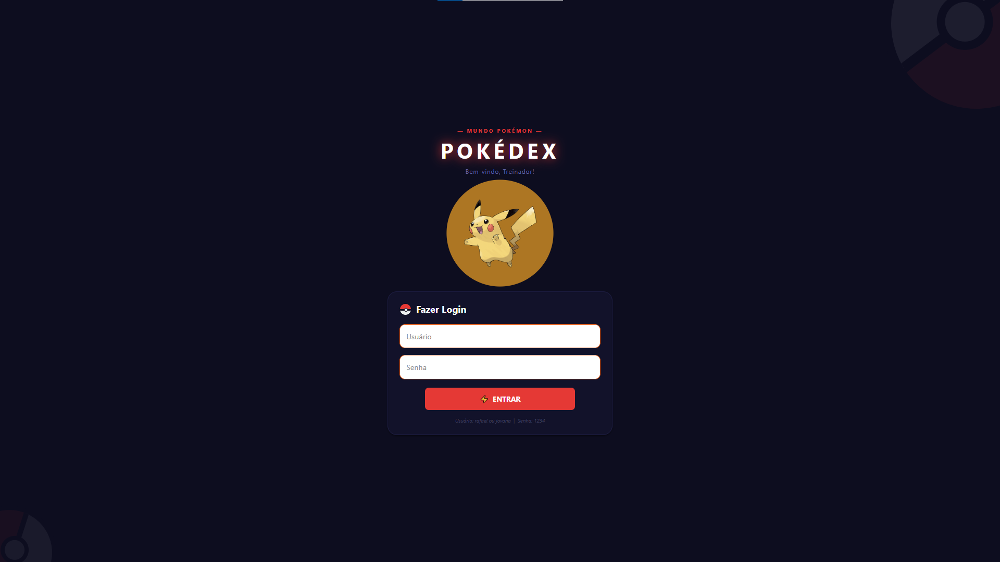
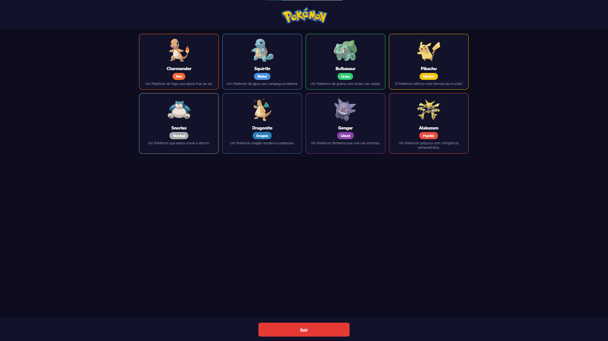

# Pokédex App

Aplicativo Pokédex desenvolvido com React Native e Expo, com suporte a Android, iOS e Web.

## Tecnologias

- [Expo](https://expo.dev/) 54
- [React Native](https://reactnative.dev/) 0.81
- [Expo Router](https://expo.github.io/router/) — navegação baseada em arquivos
- TypeScript

## Funcionalidades

- Tela de login com validação de credenciais
- Dashboard com listagem de Pokémons em grid
- Layout responsivo para Web (colunas dinâmicas por breakpoint)
- Componentes com implementações específicas por plataforma (Android / iOS / Web)

## Estrutura do Projeto

```
src/
├── app/
│   ├── _layout.tsx              # Layout raiz (AuthProvider)
│   ├── (auth)/
│   │   ├── index.tsx            # Tela de login (mobile)
│   │   └── index.web.tsx        # Tela de login (web)
│   └── (app)/
│       └── dashboard.tsx        # Dashboard com lista de Pokémons
├── components/
│   ├── alert/                   # Alerta — específico por plataforma
│   ├── button/                  # Botão — específico por plataforma
│   ├── card/                    # Card genérico reutilizável
│   ├── input/                   # Campo de texto
│   ├── icon/                    # Ícone
│   ├── pokeball/                # Pokébola decorativa e versão giratória
│   ├── pokemon-card/            # Card de Pokémon — específico por plataforma
│   ├── pokemon-list/            # Lista de Pokémons — específica por plataforma
│   └── pokemon-mascot/          # Pikachu com animação de glow
├── constants/
│   ├── pokemon.ts               # Dados estáticos dos Pokémons
│   └── colors.ts                # Paleta de cores
└── context/
    └── AuthContext.tsx          # Contexto de autenticação
```

## Componentes com versões por plataforma

Alguns componentes possuem implementações distintas para cada plataforma, seguindo o padrão de resolução do Metro Bundler:

| Componente | Android | iOS | Web |
|---|---|---|---|
| `alert` | Modal nativo | Modal nativo | Modal web |
| `button` | Largura 100% | Largura 100% | Largura máxima 320px, centralizado |
| `pokemon-card` | Borda no topo | Borda na esquerda | Borda em todos os lados |
| `pokemon-list` | 2 colunas | 2 colunas | Responsivo (1 a 4 colunas) |

## Como executar

Instale as dependências:

```bash
npm install
```

Inicie o projeto:

```bash
# Android
npm run android

# iOS
npm run ios

# Web
npm run web
```

## Credenciais de acesso

| Usuário | Senha |
|---|---|
| rafael | 1234 |
| jovana | 1234 |

## Screenshots

### Android

| Login | Dashboard |
|:---:|:---:|
|  |  |

### Web

**Login**



**Dashboard**

